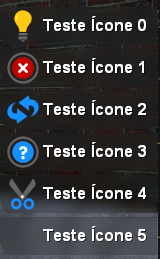

# PLAYER

### Funções monetárias

#### Obter dinheiro da carteira do personagem.



```lua
SERVER | pPlayer:GetMoney( )
```



| Retorno | Tipo |
| :--- | :--- |
| Quantia | Inteiro |

#### 

#### Obter dinheiro no banco do personagem.



```lua
CLIENT/SERVER | pPlayer:GetMoney( )
```



| Retorno | Tipo |
| :--- | :--- |
| Quantia | Inteiro |

#### 

#### Adicionar dinheiro a carteira do personagem.



```lua
SERVER | pPlayer:AddMoney( inteiro Quantidade )
```



#### 

#### Retirar dinheiro da carteira do personagem.



```lua
SERVER | pPlayer:TakeMoney( inteiro Quantidade )
```




Você também pode remover dinheiro utilizando um valor negativo em AddMoney\( \)


#### 

#### Adicionar dinheiro ao banco do personagem.



```lua
SERVER | pPlayer:AddBankMoney( inteiro Quantidade )
```



#### 

#### Remover dinheiro do banco do personagem.



```lua
SERVER | pPlayer:TakeBankMoney( inteiro Quantidade )
```



#### 

#### Verificar se o jogador pode pagar um valor \(Com dinheiro da carteira\).



```lua
SERVER/CLIENT | pPlayer:CanAfford( inteiro Quantidade )
```



| Retorno | Tipo |
| :--- | :--- |
| Resposta | Lógico |

#### 

## Funções de inventário.

#### Obter inventário do personagem.



```lua
SERVER/CLIENT | pPlayer:GetInventory()
```



| Retorno | Tipo |
| :--- | :--- |
| tbl\_Items | Tabela |



#### 

#### Substituir inventário do personagem.



```lua
SERVER | pPlayer:SetInventory( tabela Itens )
```




Isso vai substituir o inventário do personagem completamente.  
Se seu objetivo é adicionar ou remover um item específico, verifique o Módulo de inventário.




#### 

#### Obter equipamento do personagem.



```lua
SERVER/CLIENT | pPlayer:GetEquipment()
```



| Retorno | Tipo |
| :--- | :--- |
| tbl\_Equipment | Tabela |



#### 

## Funções de jogador.

#### Obter informações do personagem.



```lua
SERVER | pPlayer:GetCharacter()
```



| Retorno | Tipo |
| :--- | :--- |
| tbl\_CharData | Tabela \(Banco de dados\) |


Essa função apenas chama uma função do módulo CHARACTER usando META:


#### 

#### Obter ID do Personagem



```lua
SERVER/CLIENT | pPlayer:GetCharacterID()
```



| Resposta | Tipo |
| :--- | :--- |
| ID Personagem | Inteiro |


Essa função apenas chama outra função do módulo CHARACTER usando META:


#### 

#### Chamar notificação na tela do cliente.



```lua
SERVER | pPlayer:AddNote( string Texto, inteiro Ícone, inteiro Tempo )
```



| Ícone | Tipo |
| :--- | :--- |
| 0 | Alerta |
| 1 | Erro |
| 2 | Atualização |
| 3 | Dica |
| 4 | Tesoura |
| 5 | Branco |




Essa função também está disponível no módulo HUD, para CLIENT SIDE




